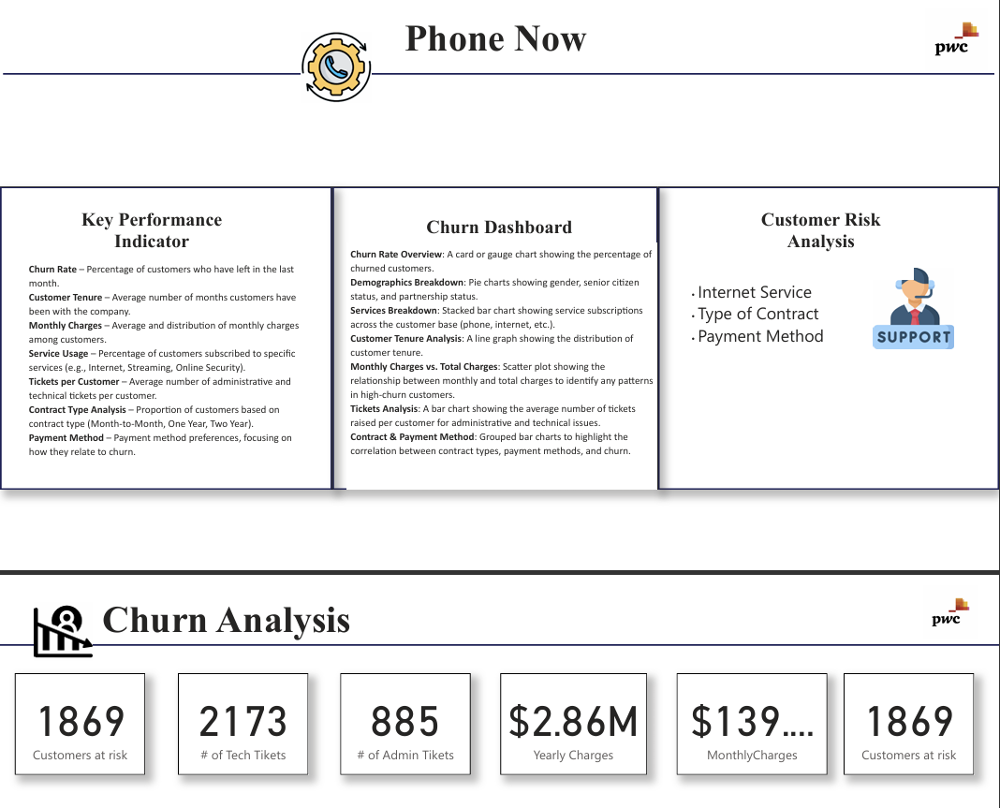
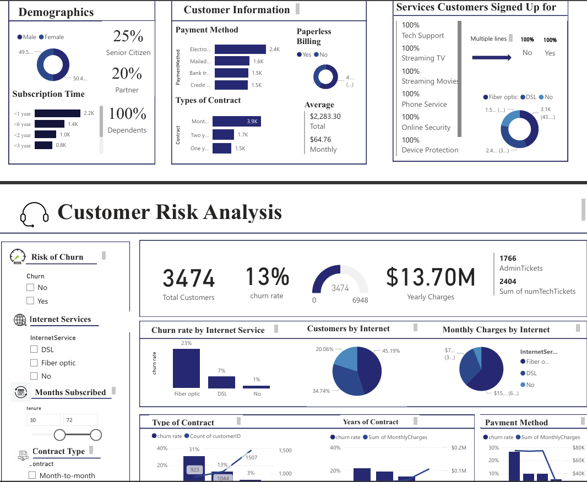

# Churn Analysis Power BI Report

## Overview
This Power BI project analyzes customer churn patterns in business data to uncover risks and factors driving customer attrition.

## Features
- Interactive dashboard highlighting churn rates by segment, region, and tenure.
- Automated trend analysis using historical data for forecasting.

## Data Sources
Anonymized customer transaction and profile data from the organization.

## Insights
- Segments with highest churn risk.
- Key business drivers of customer retention.

## Visuals

## How to Use
1. Open the Power BI file.
2. Filter by segment, date, and region to view relevant insights.

## Author

Project by [Your Name], Data Analyst Intern at Dataspark Analytics LLP.
