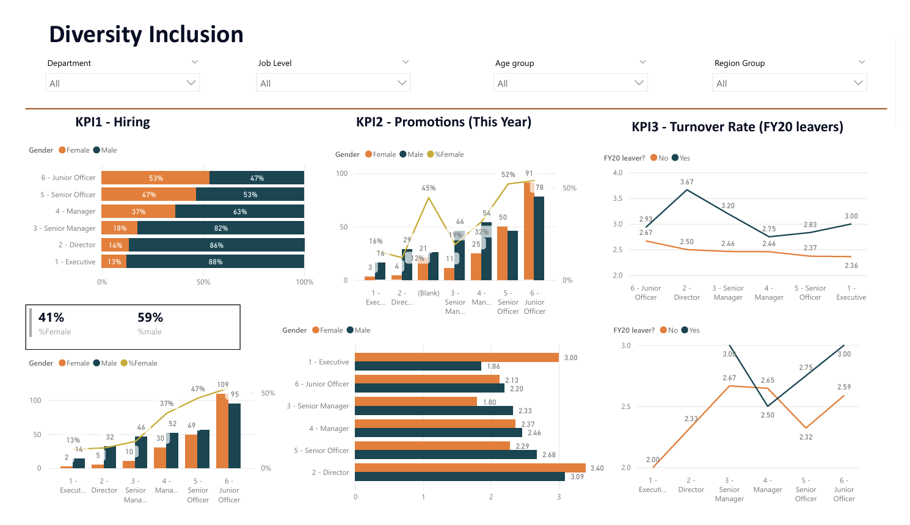
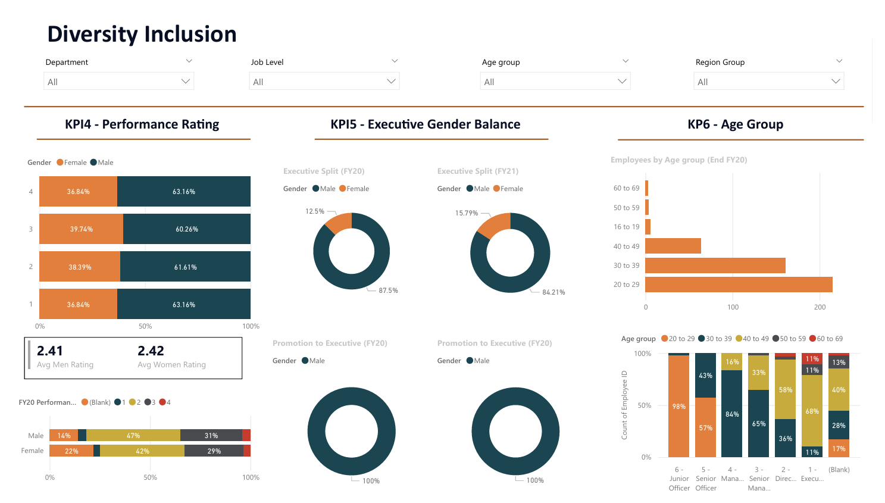
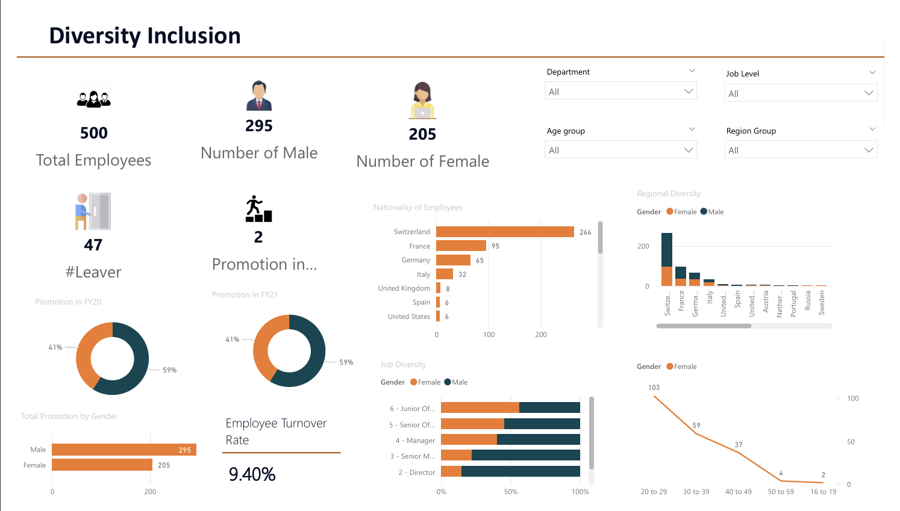

# Diversity & Inclusion Power BI Dashboard

## Overview
This dashboard visualizes workforce diversity for data-driven inclusion policies.

## Features
- Interactive graphs on gender, ethnicity, and age.
- Drill-down into departmental diversity.

## Data Sources
Anonymized HR records by department and demographic attribute.

## Insights
- Diversity gaps vs industry benchmarks.
- Progress of DEI initiatives.

## Visuals

## How to Use
1. Open the dashboard in Power BI.
2. Use filters for department/location analysis.

##Contact
Aswathi UK
Email: aswathiuk034@gmail.com
LinkedIn: https://www.linkedin.com/in/aswathi-uk-auk034/
GitHub: https://github.com/Aswathiuk

