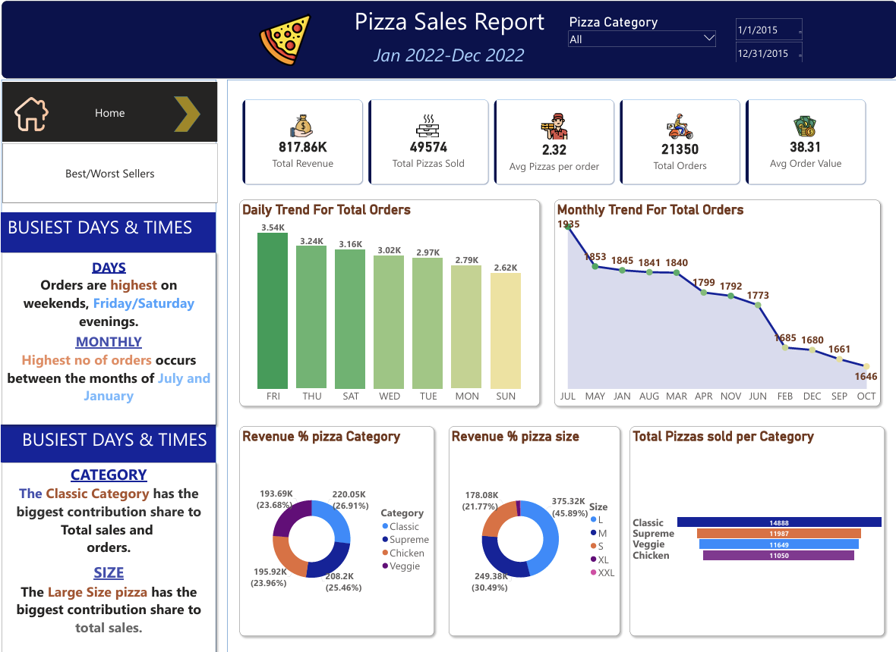
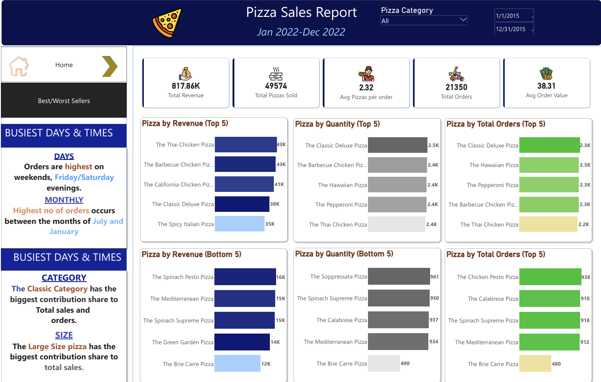

# Pizza Sales Power BI Report

## Overview
This project explores pizza sales through the business framework, with detailed KPIs for each pillar.

## Features
- Sales, operational, and strategic metrics
- Recommendations for business improvement

## Visuals

## How to Use
- Open the Power BI file
- Select pizza category and apply filters for detailed views

## Author
Project by [Your Name], Data Analyst Intern at Dataspark Analytics LLP
